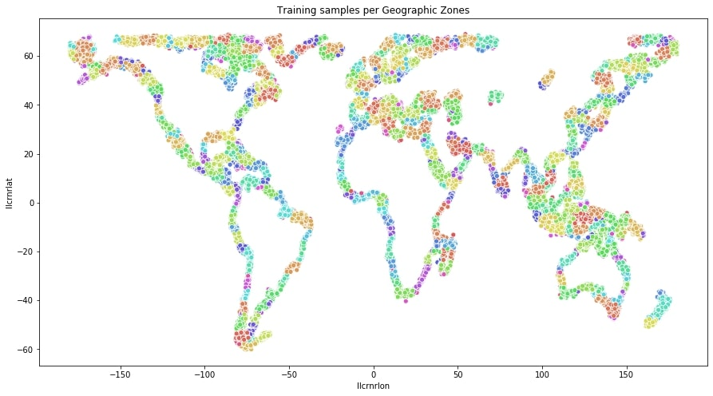
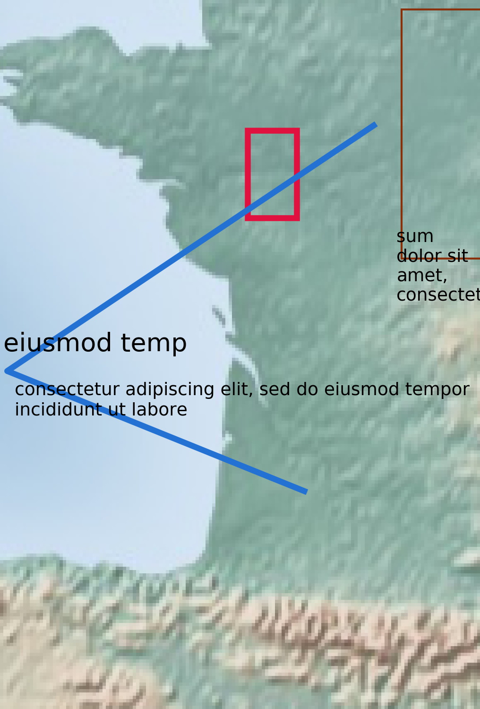
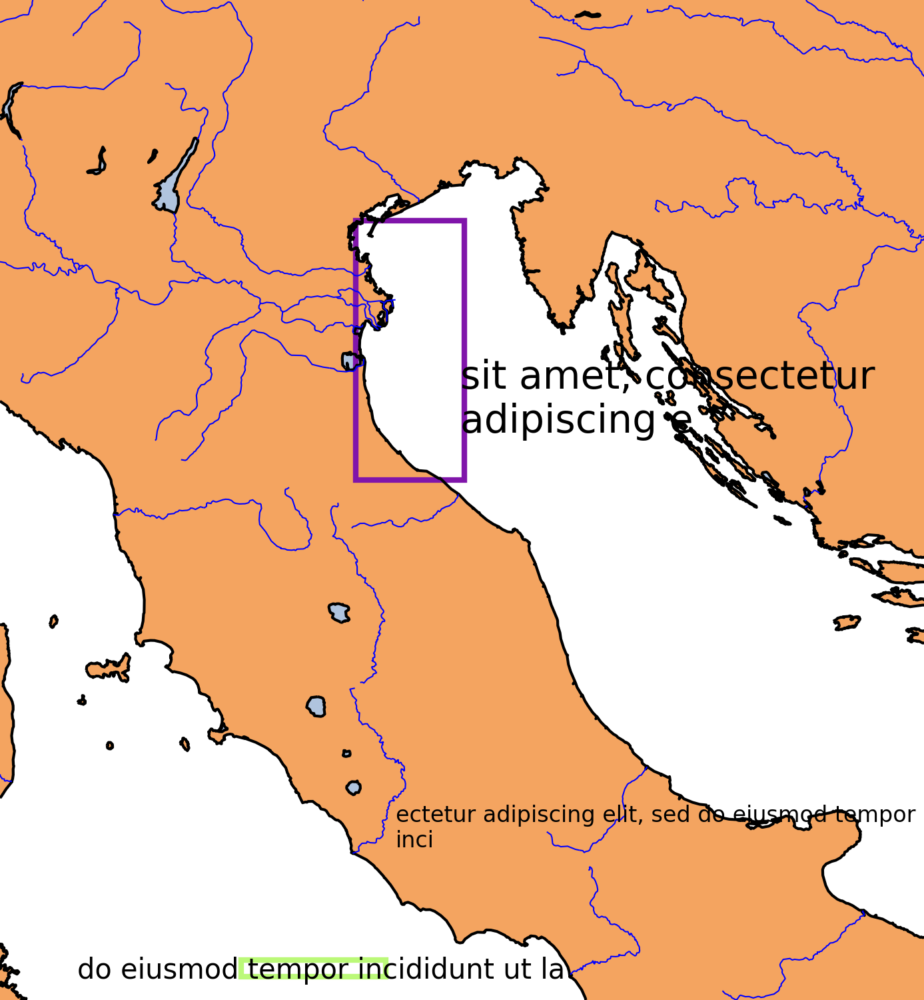
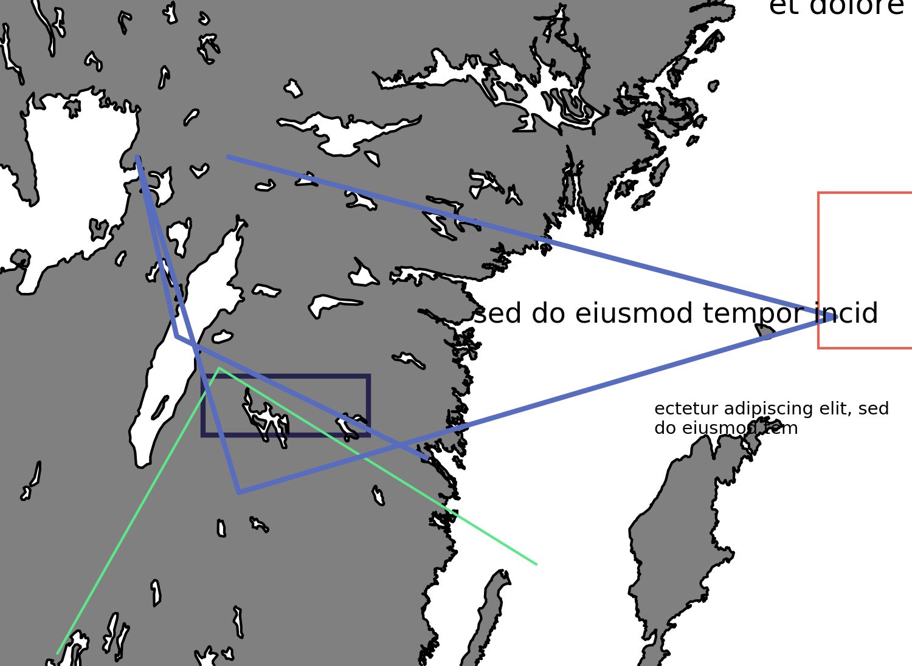

# Solution to the datascience challenge contest Put it on the map!

link to the contest: https://www.xstarter.io/challenge-details/put-it-on-the-map

  

Goal: retrieve map lattitude and longitude coordinates

Database: 40k images with known coordinates for training and 10k images for testing

Example maps (different map-styles, resolutions and annotations):

  
  
  

Download the training and test data from the contest website

Workflow of the proposed solution:

* encoding images using transfert learning from pretrained ResNet model on a geographic zones classification task (Figure 1 shown above)
* binary hash images of training images in 512 feature space
* retrieving the closest image to the one to identify in that feature space using Locality Sensitive Hashing for fast approximate nearest neighbor

### Set up the environment
Run:
<pre><code>$ pip install -r requirements.txt
</code></pre>

### Training
Run the notebook Find_similar_images_Training_submissionFinal.ipynb to access the solution

### Inference
Run the notebook Find_similar_images_Inference_submissionFinal.ipynb to apply the trained models to the test database

### Interesting feature: Ability of the model to find closest images in the database robust to resolutions, annotations, image motions and map types
3 random examples of closest images:

  
  
  

Once your model is trained run several the last cell of Find_similar_images_Training_submissionFinal.ipynb notebook to see more random examples.
